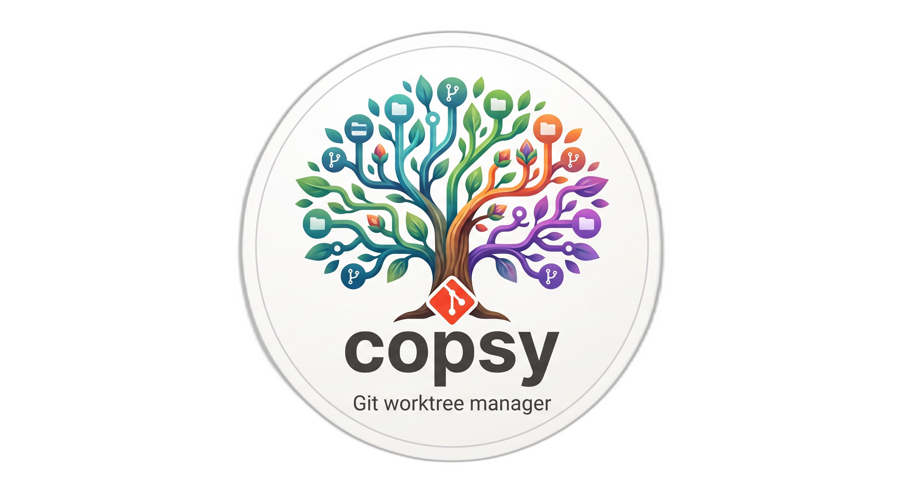

<p align="center">
  
</p>

<h1 align="center">copsy</h1>

<p align="center">
  A git worktree management CLI that makes it easy to create, switch, and manage worktrees with interactive branch selection, PR checkout, and editor/AI tool integration.
</p>

[日本語版 README](README.ja.md)

## Features

- **Interactive branch selection** with fuzzy search — local branches, remote branches, and existing worktrees
- **PR checkout** — create a worktree directly from a GitHub PR number or URL
- **Shell integration** — actually `cd` into worktrees (not just print the path)
- **Editor/AI launch** — open VS Code, Cursor, Claude Code, or Codex CLI after switching
- **Tab completion** — zsh/bash completion for subcommands, branch names, and worktree names
- **Color-coded output** — distinguish repos, worktrees, local branches, and remote branches at a glance
- **Configurable worktree directory** — choose where worktrees are created
- **Repository setup** — copy ignored files and run a command for new worktrees

## Requirements

- Rust (edition 2024)
- Git
- [gh](https://cli.github.com/) (GitHub CLI) — required for `copsy pr`

## Install

```sh
cargo install --path .
```

### Shell integration

Add to your `~/.zshrc`:

```sh
eval "$(copsy init zsh)"
```

Or for bash, add to your `~/.bashrc`:

```sh
eval "$(copsy init bash)"
```

This sets up a shell function that enables `cd` into worktrees, tab completion,
and TTY-preserving repository setup execution.

## Usage

### Interactive mode

```sh
copsy
```

Run without arguments to get a fuzzy-searchable list of all branches and worktrees. Select one to:
- **Existing worktree** — switch to it
- **Local/remote branch** — create a new worktree and switch to it

Press **Esc** to cancel.

### Commands

| Command | Description |
|---|---|
| `copsy new <branch>` | Create a worktree with a new branch |
| `copsy add <branch>` | Create a worktree for an existing branch |
| `copsy switch` (`sw`) | Fuzzy-select an existing worktree to switch to |
| `copsy remove` (`rm`) | Fuzzy-select a worktree to remove |
| `copsy list` (`ls`) | List all worktrees |
| `copsy status` | Show `git status --short` for every worktree |
| `copsy close` | Close the current worktree and return to the main worktree |
| `copsy pr [target]` | Checkout a PR as a worktree (interactive if target omitted) |
| `copsy config repo` | Create repository configuration interactively |
| `copsy config global` | Create global configuration interactively |
| `copsy setup` | Run repository setup for the current worktree |
| `copsy init <shell>` | Print shell integration script (`zsh` or `bash`) |

### PR checkout

```sh
copsy pr 123                                       # by PR number
copsy pr https://github.com/owner/repo/pull/123    # by URL
copsy pr                                           # interactive selection
```

Fetches the PR branch and creates (or switches to) a worktree for it.

### Launch flags

Open editors or AI tools after switching. Flags can be combined:

```sh
copsy --claude              # Launch Claude Code
copsy --codex               # Launch Codex CLI
copsy --code                # Open VS Code
copsy --cursor              # Open Cursor
copsy --open "my-command"   # Run a custom command

copsy add feature --claude --code   # Create worktree + open VS Code + launch Claude
copsy pr 42 --cursor                # Checkout PR #42 + open Cursor
```

| Flag | Short | Tool |
|---|---|---|
| `--claude` | `-c` | Claude Code |
| `--codex` | `-x` | Codex CLI |
| `--code` | | VS Code |
| `--cursor` | | Cursor |
| `--open <cmd>` | | Custom command |

## Configuration

### Herdr-compatible worktrees

Use `--herdr` to create worktrees with [Herdr](https://github.com/herdrdev/herdr)'s
directory and naming rules:

```sh
copsy new Feature/Login --herdr
copsy --herdr add fix/typo
copsy pr 123 --herdr
copsy --herdr                     # Interactive branch selection
```

The flag works before or after a subcommand. For worktree creation it overrides
copsy's `worktree.base_dir` and `worktree.layout` for that invocation. Without
the flag, copsy keeps its usual layout. Other commands still discover existing
worktrees through Git, regardless of their directory layout.

By default, a clone at `~/dev/myapp` creates `Feature/Login` at
`~/.herdr/worktrees/myapp/feature-login`. The root comes from Herdr's
`[worktrees].directory` in `~/.config/herdr/config.toml` (or
`$XDG_CONFIG_HOME/herdr/config.toml`); `HERDR_CONFIG_PATH` overrides the config
file location. A missing file or unset directory uses `~/.herdr/worktrees`.
`~` and `~/` expand to the home directory; relative roots resolve against the
invoking working directory. Invalid or unreadable settings cause an error.

The repository name follows the local Git common directory rather than the
`origin` remote, so a clone renamed to `myapp-local` uses `myapp-local`.
Branch slugs lowercase ASCII letters, replace runs of non-ASCII-alphanumeric
characters with `-`, and strip leading/trailing dashes. An empty slug uses
`worktree`. Different branches that produce the same slug cannot share a
directory; copsy reports a collision instead of switching to the wrong branch.

This matches Herdr v0.9.1's path rules. When run inside Herdr (`HERDR_ENV=1`),
`new`, `add`, `pr`, and interactive creation also call `herdr worktree open` to
register the checkout as a child workspace of the repository's parent space.
This preserves focus and uses the main checkout as the source, including when
invoked from a linked worktree. Reusing an existing checkout retries registration.
Herdr's JSON responses do not enter the shell navigation marker channel.

Outside Herdr, the flag creates the same paths and prints a notice that workspace
registration was skipped. The Herdr executable is only required for registration.
If registration fails, copsy warns and keeps the Git checkout and navigation;
retry with `copsy add <branch> --herdr` inside Herdr. It does not grant repository
trust automatically.

Run `copsy config global` to create the global configuration interactively at
`~/.config/copsy/config.toml` (respects `$XDG_CONFIG_HOME`). It configures the
default worktree directory, the directory layout, and whether uncommitted
changes are carried by default.

```toml
[worktree]
# Directory where worktrees are created (default: parent of the main worktree)
# Supports ~ expansion
base_dir = "~/worktrees"
# How worktree directories are arranged: "flat" (default) or "nested"
layout = "nested"
# Carry uncommitted changes when switching worktrees
carry_changes = true
```

Without `base_dir`, worktrees are created alongside the main worktree. The
`flat` layout names each one `<repo>-<branch>`; the `nested` layout groups them
under a `<repo>` directory, which becomes `<repo>-worktrees` when `<repo>` is
the main worktree itself — the case in a default clone.

The command is create-only and will not overwrite an existing configuration.

### Repository setup

Run `copsy config repo` to create machine-local repository configuration at
`<git-common-dir>/copsy.toml`. The initializer can override the global worktree
directory and layout, select ignored files to copy from the main worktree, and
choose which worktree commands run setup automatically.

```toml
# [worktree]
# base_dir = "~/worktrees"
# layout = "flat"
[setup]
auto = ["new"]
# command = ["npm", "install"]
copy_from_main = [
  ".env",
  ".env.local",
]
```

Repository `base_dir` and `layout` override the global values. Unset repository
values inherit the global configuration.
The command is create-only and will not overwrite an existing configuration.

`auto` accepts `new`, `add`, and `pr`. Omit it or leave setup unconfigured to
keep the default no-setup behavior.

Setup copies configured files and directories before running `command`.
Existing destinations are never overwritten. Run setup explicitly with
`copsy setup` or `--setup`; use `--no-setup` to override `auto`.
`copsy setup` and automatic setup use the shell integration so interactive
commands such as package managers retain the current terminal.

```sh
copsy new feature --setup
copsy add existing --no-setup
copsy setup
```

Setup commands can execute arbitrary code. Automatic setup for `copsy pr`
should only be enabled for repositories and pull requests you trust.

After upgrading, restart the shell or re-evaluate `copsy init zsh`/`copsy init
bash` so the shell wrapper recognizes setup requests.

## Worktree naming

`/` in branch names is replaced by `-` in both layouts, so a worktree directory
is never deeper than the layout itself prescribes.

`<repo>` comes from the URL of the repository's primary remote, so it stays the
same even if the clone directory is renamed. The primary remote is `origin`
when it exists, otherwise the only remote, otherwise the remote that `gh repo
set-default` resolved. Without any of these, the main worktree's directory name
is used instead.

The default `flat` layout names each worktree `<repo>-<branch>`:
- Repository `myapp`, branch `feature/login` → `myapp-feature-login`
- Repository `myapp`, branch `fix-typo` → `myapp-fix-typo`

The `nested` layout places each worktree at `<repo>/<branch>`, which keeps a
shared `base_dir` grouped by repository:
- Repository `myapp`, branch `feature/login` → `myapp/feature-login`
- Repository `myapp`, branch `fix-typo` → `myapp/fix-typo`

When that `<repo>` directory would be the main worktree itself, `-worktrees` is
appended to it. This occurs when `base_dir` is unset and the main worktree's
directory name matches the repository name, which is how `git clone` leaves it
by default:
- Main worktree `~/dev/myapp`, branch `fix-typo` → `~/dev/myapp-worktrees/fix-typo`
- Main worktree `~/dev/myapp-main`, branch `fix-typo` → `~/dev/myapp/fix-typo`

The directory holding the nested worktrees is removed once its last worktree is
gone.

Without `--herdr`, worktrees are always placed next to the main worktree (or under `base_dir`),
including when `copsy new` or `copsy add` is run from inside another worktree.

## License

MIT
